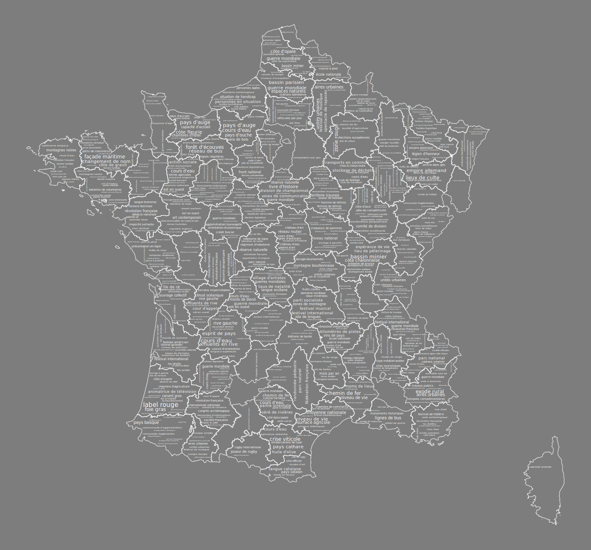

# Mapping WordCloud

## Install the requirements

    pip3 install -r requirements.txt

## Run

    python3 map.py <shape_file> <primary_key_column> <word_frequencies_json_file> <outputfilename> --format <format>

 * `<primary_key_column>` : column in the shape file used to get words frequencies in `<word_frequencies_json_file>`
 * `<word_frequencies_json_file>` json file that contains word frequencies for each region identified using  `<primary_key_column>`
 * `<format>` output format. For now, only `pdf`, `png` and `svg` are available (`pdf` is default)

## Example

Datasets are given in the `data` directory. Run the following command to generate the map :

    python3 map.py data/gis/france_metropolitaine code_insee data/count/wikipedia_dep.json "wikipedia2.svg" --format "svg"

The output should be as follow:

